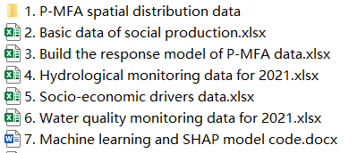
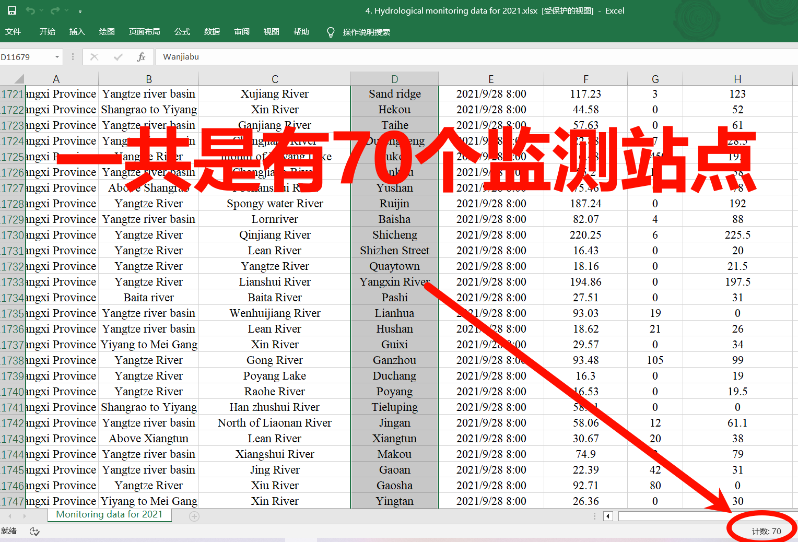
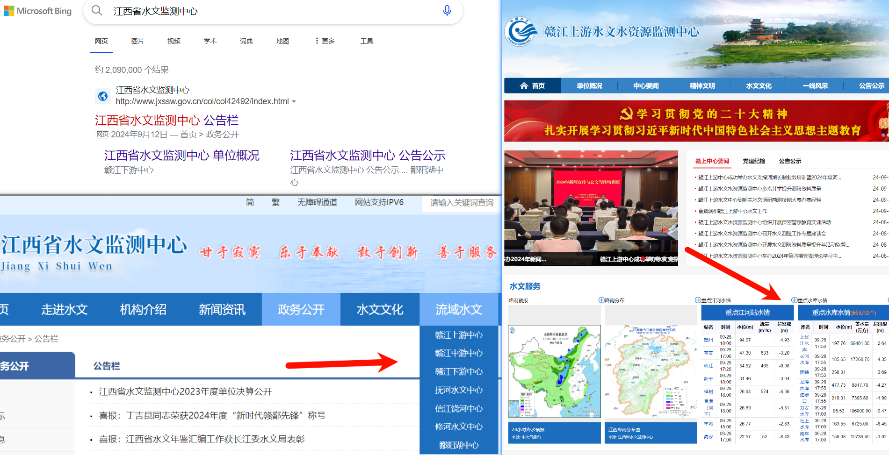
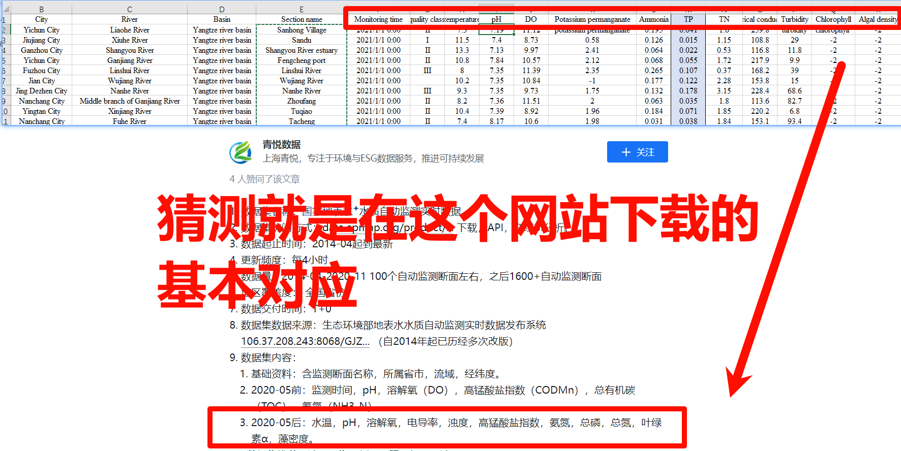
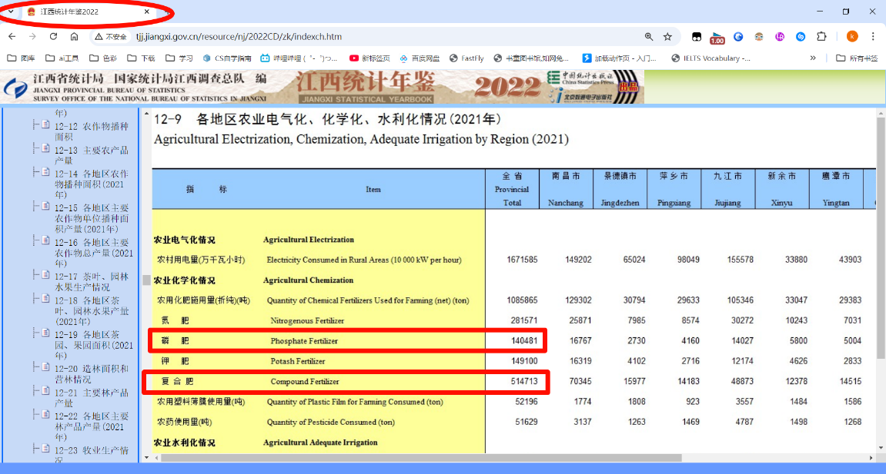
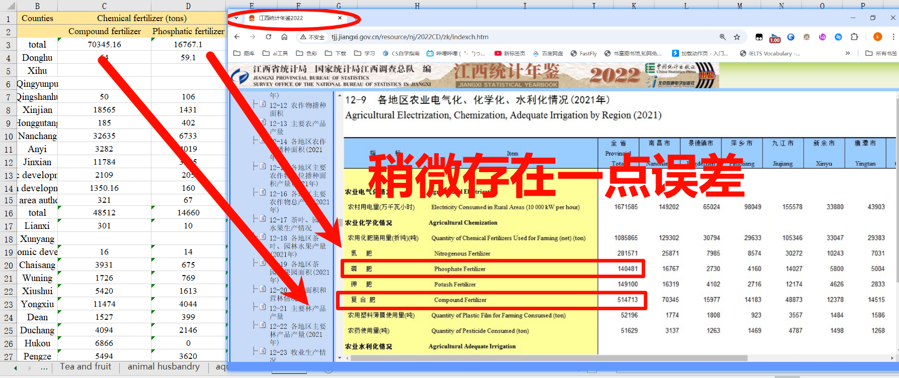

# 复刻论文数据

# 4.Hydrological monitoring data怎么来的？

【尝试1】百度搜索江西省水文监测中心，发现数据格式都对得上，就是站点没有70个，大约40个左右。
差不多了，这事情就告一段落了。

# 6.water quality 怎么来的
【感觉猜对了】基本上是来源于私人数据库，一年的数据价格100r左右。

# 2.basic data of social 这个应该是江西省统计年鉴里面来的但是给的数据和我查询到的有10%左右的误差。

